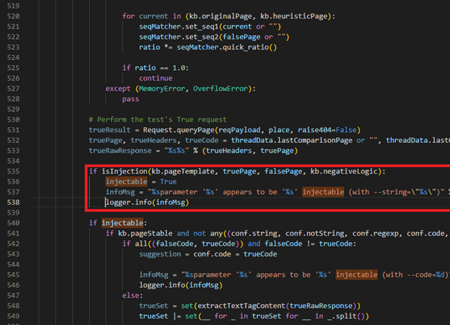
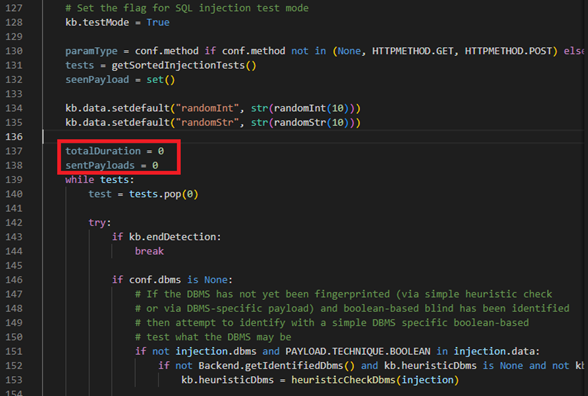
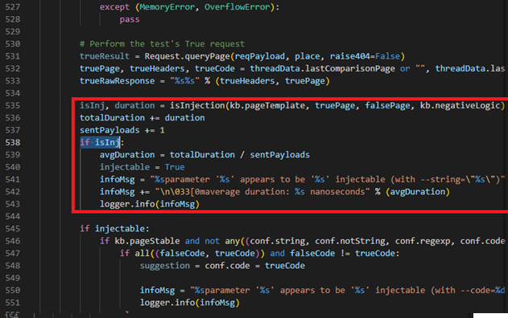
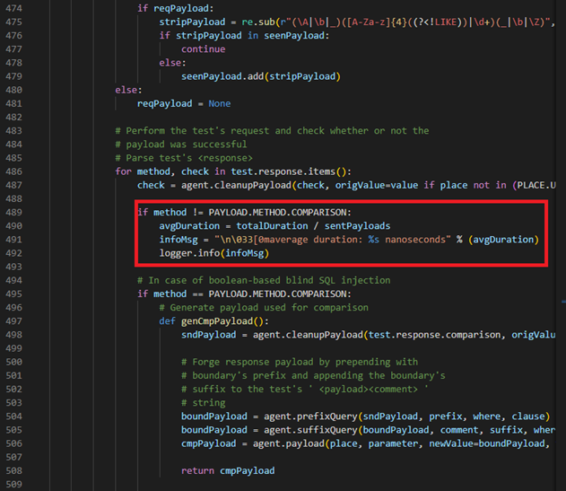
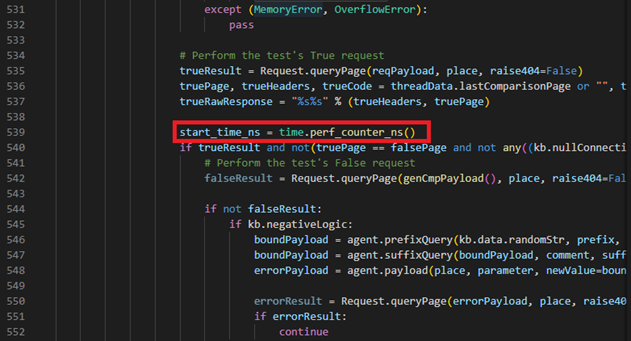
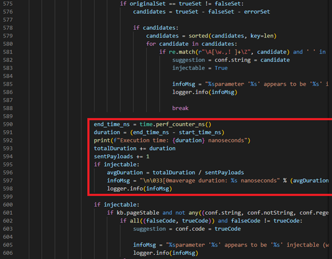

Info for whoever thinks this is for malicious purposes because it contains SQL injection vulnerability results. Those are test cases for my bachelor's work. If you inspect the file contents you will see that the specified URLs for the detected vulnerabilites are mostly IP addresses like 192.168.17.134 or localhost, except for hackazon.lc. It was ip address which I did name for my own testing purposes. If you try to find a site "hackazon.lc" online you will find that it doesn't exist. For more proof of it being ethical hacking I will provide the sources of the testing servers:
1. Hackazon: https://github.com/rapid7/hackazon 
2. Owasp Juice Shop: https://github.com/juice-shop/juice-shop
3. sqli-labs: https://github.com/Audi-1/sqli-labs
4. MCIR (SQLol): https://github.com/SpiderLabs/MCIR
5. Web for Pentesters II: https://www.vulnhub.com/entry/pentester-lab-web-for-pentester-ii,68/

Risinājumu installācijas instrukcijas:
Lai instalētu risinājumu, nepieciešams to ievietot direktorijā "sqlmap/lib/utils". Pēc tam failā "sqlmap/lib/controller/checks.py" jāpievieno atbilstošu importēšanas rindiņu: "from lib.utils.isInjection import isInjection as isInjection", "from lib.utils.isInjection import debug_isInjection as isInjection" vai "from lib.utils.isInjection import clear_isInjection as isInjection", atkarībā no izvēlētā risinājuma. Funkcionālajai un debug versijai papildus jāievieto fails "make_string_equal.py" direktorijā "sqlmap/lib/utils". Kad risinājums ir importēts, rindas no 532. līdz 580. jāaizstāj ar 6.1.1. attēla kodu .

<b>6.1.1. attēls:</b>

 

```python
                            if isInjection(kb.pageTemplate, truePage, falsePage, kb.negativeLogic):
                                injectable = True
                                infoMsg = "%sparameter '%s' appears to be '%s' injectable (with --string=\"%s\")" % ("%s " % paramType if paramType != parameter else "", parameter, title, repr(conf.string).lstrip('u').strip("'"))
                                logger.info(infoMsg)
```

Ja vēlamies redzēt vidējo isInjection ātrumu, tad vajag lietot “debug_risinajuma_nosaukums.py” risinājuma versiju un 136. rindiņā (tieši pirms “while tests:”) ievietot kodu “totalDuration = 0; sentPayloads = 0”, kurš arī redzams 6.1.2. attēlā zemāk, un 532. līdz 580. rindiņu vajag aizvietot ar kodu, kurš redzams 6.1.3. attēlā (un kuru arī ir iespējams iekopēt no github repozitorijas README.md faila (https://github.com/studentsvmdivi/sqlmap_uzlabojumi_un_testpiemeri/)).

<b>6.1.2. attēls:</b>

 


```python
    totalDuration = 0
    sentPayloads = 0
```

<b>6.1.3. attēls:</b>

 


```python
                            if isInj:
                                avgDuration = totalDuration / sentPayloads
                                injectable = True
                                infoMsg = "%sparameter '%s' appears to be '%s' injectable (with --string=\"%s\")" % ("%s " % paramType if paramType != parameter else "", parameter, title, repr(conf.string).lstrip('u').strip("'"))
                                infoMsg += "\n\033[0maverage duration: %s nanoseconds" % (avgDuration)
                                logger.info(infoMsg)
```

Ja vēlamies redzēt oriģinālā risinājuma ātrdabību, tad vajag atrast ar CTRL+F 6.1.4., 6.1.5. un 6.1.6. attēlā redzamās vietas un ievietot kodu, kurš atzīmēts 6.1.4., 6.1.5. un 6.1.6. attēlā ar sarkanu rāmīti. <b>KĀ ARĪ 136. rindiņā (tieši pirms “while tests:”) ievietot kodu “totalDuration = 0; sentPayloads = 0”, kurš arī redzams 6.1.2. attēlā</b>

<b>6.1.4. attēls:</b>

 

```python
                        if method != PAYLOAD.METHOD.COMPARISON:
                            avgDuration = totalDuration / sentPayloads
                            infoMsg = "\n\033[0maverage duration: %s nanoseconds]" % (avgDuration)
                            logger.info(infoMsg)
```

<b>6.1.5. attēls:</b>

 

```python
                            start_time_ns = time.perf_counter_ns()
```

<b>6.1.6. attēls:</b>

 

```python
                            end_time_ns = time.perf_counter_ns()
                            duration = (end_time_ns - start_time_ns)
                            print(f"Execution time: {duration} nanoseconds")
                            totalDuration += duration
                            sentPayloads += 1
                            if injectable:
                                avgDuration = totalDuration / sentPayloads
                                infoMsg = "\n033[0maverage duration: %s nanoseconds" % (avgDuration)
                                logger.info(infoMsg)
```

<h2><b>Testpiemērus tulīt pievienošu pēc vienas studnas. Pagaidām mēģinu tikt galā risinājumu instrukciju rakstīšanu.</b></h2>
